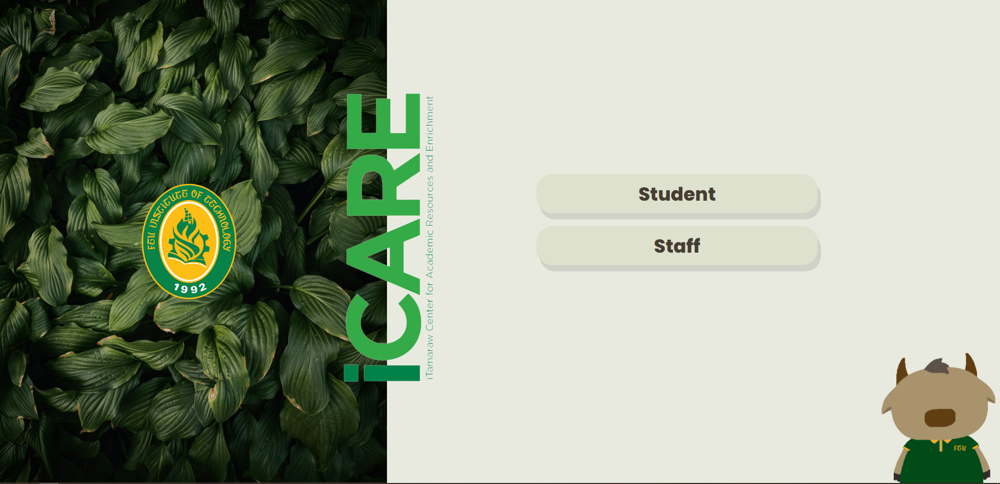
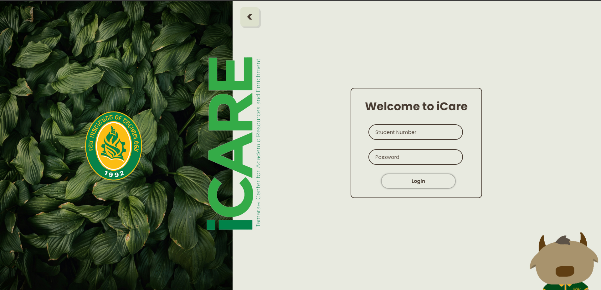
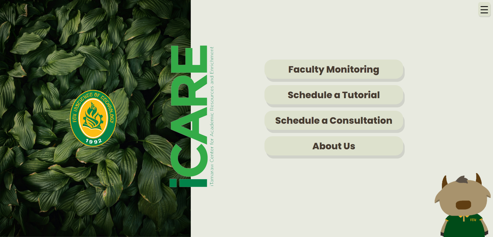
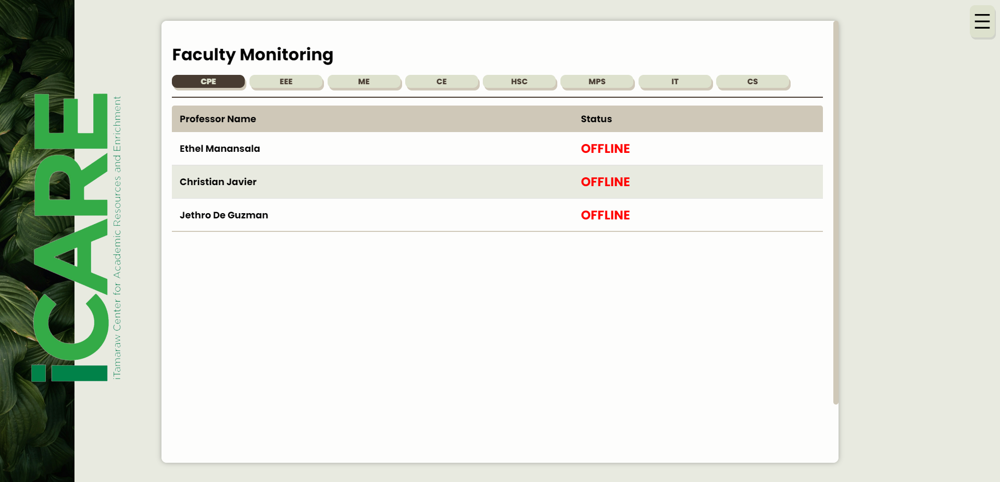
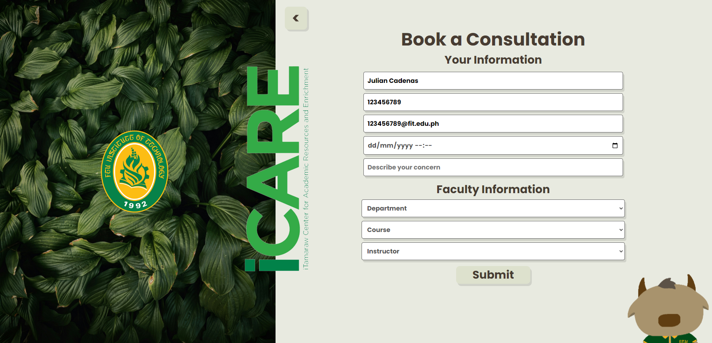
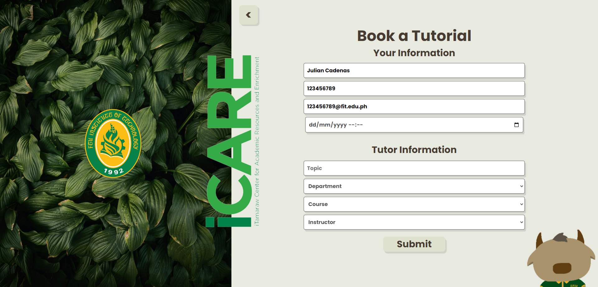

# ICARE WEBSITE - Data Structures and Algorithms Final Project

A website where students can book consultations and tutorial sessions with their professors

Final requirement in CPE0035L Data Structures and Algorithms and CPE0033L Database

This website is hosted in phpmyadmin using xampp.
The sql database file is imported into phpmyadmin with a database of the same name.

## This website was built using the following technologies:

**HTML**: For creating the structure and content of the web pages.

**CSS**: For styling the web pages and making them visually appealing.

**JavaScript**: For adding interactivity and dynamic behavior to the web pages.

**PHP**: For server-side scripting and managing the backend logic of the application.

**SQL**: For database management

## The Website: 

### The website's homepage displays the two types of users who can access the site.

### The login page, this layout is similar for both the staff and students

### A logged-in student's dashboard where he can check if his professor is online and book consultations or tutorials

### The faculty monitoring page where the users can check if a professor is ONLINE or OFFLINE

### The student's name, student number and email is already automatically inputted from their login credentials if they choose to book a consultation or tutorial

